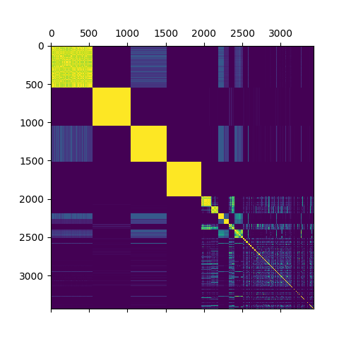

# Approximate Byte-based n-gram Analysis Tool

Can be used to compare a bunch of files.  
Makes use of mmap-ing, sparse vectors and all your CPUs to be decently fast.

Usage:

```
ngrm [FLAGS] [OPTIONS] -n <n> --output <output> [FILES]...

FLAGS:
    -h, --help       Prints help information
    -s, --silent     Silence output
        --stats      Print top 25 most common sequences
        --stdin      Read input file paths from stdin instead of the arguments
    -V, --version    Prints version information

OPTIONS:
    -m, --vector-length <m>    The desired vector size. Higher values give more precise results. The required working
                               memory will be O(n * m). This value should be chosen as high as your RAM permits (default
                               is 100,000)
    -M, --mapping <mapping>    Optional output file with a mapping of (file |-> index in matrix)
    -n <n>                     The n in n-gram (Byte sequence length)
    -o, --output <output>      Output file for similarity matrix

ARGS:
    <FILES>...    Input files
```

## Example

The following command runs the analysis on all files in ~/data/,
which have a combined size of 3.8 GB. A similarity matrix
is generated and written to matrix.csv.
```
$ ngrm -n 8 ~/data/*.* -o matrix.csv
```
This takes about 12.3 seconds to run on my machine (NVMe SSD, Ryzen 9 3900X with 24 threads @ 3.8 GHz).
The similarity matrix can then (for example) be used together with a clustering
algorithm like the one included in this repo:
```
$ python ward_cluster.py matrix.csv
```
...which produces this output:



In this plot, each point (x, y) has a brightness value
corresponding to how similar the files x and y are.
E.g. all points on the diagonal (x,x) should have a value of 1 and
are bright yellow, as each file is completely similar to itself.
Each cluster corresponds to a set of files that are similar or identical.